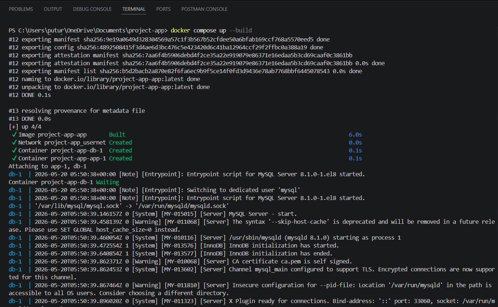
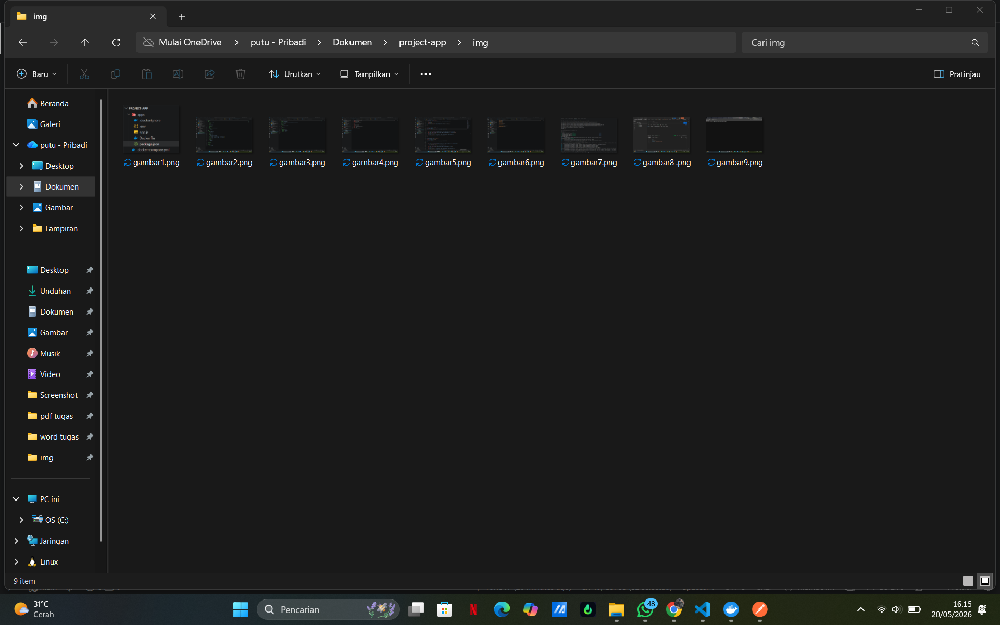
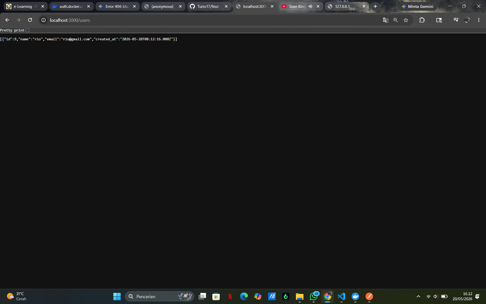

# Laporan Hasil Praktikum: Final Project Aplikasi Berbasis Container

## Identitas Mahasiswa

- **Nama:** i putu rio ciptarikayana
- **NIM:** 2415354039
- **Kelas/Rombel:** TRPL C
- **Tanggal Praktikum:** 20 Mei 2026

---

## Teknologi & Tools yang Digunakan

- **Sistem Operasi:** Windows
- **Containerization:** Docker & Docker Hub
- **Bahasa Pemrograman / Framework:** Node.js
- **Tools Lain:** VS Code, Git, Postman

---

## Langkah-Langkah Praktikum & Dokumentasi

### Langkah 1: [Tulis Nama Langkah 1, Contoh: Membuat Dockerfile]

Jelaskan secara singkat apa yang dilakukan pada langkah pertama ini. Jika ada kode atau perintah terminal, tulis seperti contoh di bawah:

```bash
# Contoh perintah terminal yang dijalankan
docker compose up 
docker compose up --build
```

**Dokumentasi/Screenshot:**


---

### Langkah 2: [Tulis Nama Langkah 2, Contoh: Tag dan Push ke Docker Hub]

Jelaskan proses penamaan ulang _image_ dan proses unggah ke Docker Hub milik Anda.

```bash
docker tag app-good madedianpp/app-good
docker push madedianpp/app-good
```

**Dokumentasi/Screenshot:**

---

### Langkah 3: [Tulis Nama Langkah 3, Contoh: Pengujian Pull dan Run Container]

Jelaskan bagaimana cara melakukan verifikasi atau pengujian bahwa praktikum Anda berhasil berjalan.

```bash
docker compose up http://localhost:3000/users
```

**Dokumentasi/Screenshot:**


---

## Kesimpulan
Praktikum berhasil membangun aplikasi User Service multi-container menggunakan Node.js dan MySQL. Kendala yang ditemui adalah sinkronisasi startup antara backend dan database, dan solusinya adalah menggunakan Docker Compose dengan healthcheck serta retry koneksi di aplikasi.